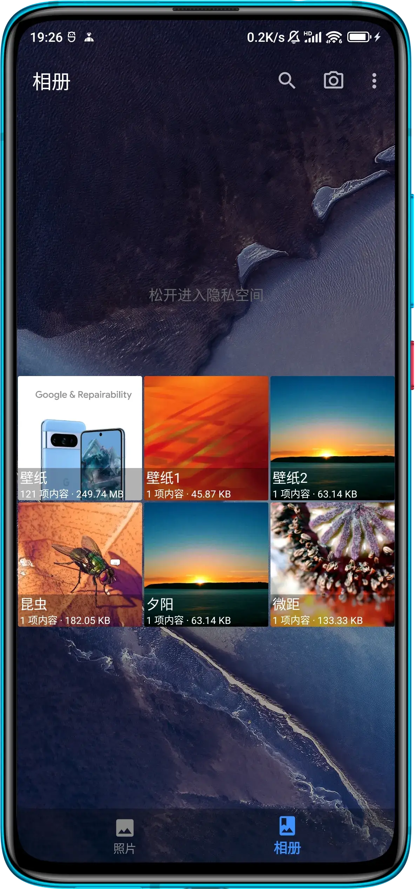

## 常见问题

> 下列问题收集与使用者的反馈，如果你有更好的解决方案，欢迎提出来，我们一起完善这个文档。

#### 1. 如何打开隐私空间 ?

- 在相册一列，下拉即可打开隐私空间，进入隐私空间需要输入PIN码

 

      
 

- 打开 `设置` -> `显示关闭提示对话框` ，点击关闭 。关闭删除照片对话框后，删除照片将不会再提示是否删除，直接移动到回收站。

#### 2. 如何隐藏删除照片的提示框 ?

- 打开 `设置` -> `显示关闭提示对话框` ，点击关闭 。关闭删除照片对话框后，删除照片将不会再提示是否删除，直接移动到回收站。

#### 3. 文件传输助手和问题反馈无法使用多窗口 ?

- 在vivo手机上，文件传输助手/问题反馈无法像微信小程序一样使用多窗口打开， 该问题属于vivo手机的限制， 请向vivo手机客服寻求帮助。
- 在华为手机上,荣耀手机，如果文件传输助手/问题反馈的多窗口被杀死，可能导致慢图浏览主窗口应用程序崩溃，该问题属于华为手机(荣耀手机)的特有问题，请向华为手机（荣耀手机）客服寻求帮助。

#### 4. 快捷方式无法在桌面打开? 
- 经过测试发现vivo手机可能出现该情况，该手机需要打开 `后台弹出界面` 的权限后，发送到桌面的快捷方式即可正常打开。

#### 5. 慢图浏览的文件传输助手(WebDAV服务)，无法通过第三方设备访问

经用户反馈，该用户手机里面使用了一款企业网络软件(组网/代理)，拦截了该手机的入站流量，对于这种情况我们无法提供给您任何帮助，请寻求网络管理员或者软件客服的支持。当然您也可以选择在使用慢图浏览提供的文件传输助手时，停止使用该企业的网络软件。带来的不便，敬请谅解。

#### 6. 慢图浏览在后台运行的时候，文件传输助手或者WebDAV备份无法使用。

1.  OPPO/OnePlus/真我手机用户：
    - `长按应用进入应用详情` -> `耗电管理` -> `允许完全后台行为`
    - `长按应用进入应用详情` -> 关闭 `暂停未使用应用的活动` 
2.  小米/红米手机
    -  允许应用后台联网
    -  允许自启动
    -  电池耗电中忽略慢图浏览 -> 选择无限制
3. 华为手机
    - `设置` -> `应用管理` -> `允许自启动,允许后台允许`
    - `设置` -> `联网` -> `允许后台联网`
4. Vivo以及其他手机
    - 允许慢图后台联网
    - 允许慢图浏览后台运行
  
总之就是对慢图浏览放开限制，开启 `后台允许运行权限` 和 `允许后台使用网络`。

#### 7. 照片移动到隐私空间后，如何查看隐私空间？
-  点击底部的相册一栏，然后下滑，会出现文字[[松开进入隐私空间]]。

#### 8.  编辑功能  
通过我们的测试发现:

- OPPO手机: 通过照片详情页选择OPPO手机的编辑后，照片将会被删除，并且会新创建一张照片，所以在使用OPPO手机系统相册编辑后，我们退出当前浏览页面.

- 三星手机: 三星自带的相册暂时不向第三方应用提供编辑。可以通过： 其他应用打开选择三星系统相册，然后再使用该编辑功能,三星相册编辑后，可以保存到原图。

- 小米手机: 实际测试小米手机在使用默认相册编辑后，会覆盖原图，在这种情况下，慢图会直接刷新当前照片，并且提示用户该图片已经被修改。

#### 9. 壁纸功能

慢图支持使用系统壁纸，和应用自带壁纸，以及禁止壁纸，壁纸模式只支持在夜间主题下使用。慢图暂时不支持设置系统视频壁纸。

#### 10. 部分照片没有在慢图浏览中显示

打开 `设置` -> `缓存` -> 点击 `找回未显示在相册中的照片` ，该操作耗时较长，请不要离开慢图浏览保持前台运行。

#### 11. 如何清理相册中的空图片(文件体积为0)

打开 `设置` -> `缓存` -> 点击 `清理没有内容的文件` ，该操作耗时较长，请不要离开慢图浏览保持前台运行。

#### 12. 照片的时间线显示错误或者出现超过2024年照片的图片

打开 `设置` -> `缓存` -> 点击 `刷新媒体库` ，该操作耗时较长，请不要离开慢图浏览保持前台运行。

#### 13. 部分用户使用快图浏览修改某个相册(camera)为(camera1)，发现使用慢图浏览或者其他相册查看camera相册，里面的照片无法查看?并且camera1的相册也没有显示。

由于快图浏览使用暴力的rename方式直接修改文件夹，导致camera相册的媒体库并没有被删除，导致camera相册在媒体库中依然存在，这个时候使用其他相册依然可以看到该相册，但是无法查看具体图片内容。并且camera1也无法在其他相册中查看到。
请在慢图浏览 -> 设置 -> 依次点击刷新媒体库，找回未显示在相册中的照片、清理没有内容的文件，用于修复其他相册不合理的行为。

#### 14. 隐私空间的相册封面如何降低隐私泄漏?

打开隐私空间后，点击右上角3个点, 然后点击隐藏封面，选中后，移动照片到隐私空间封面将会以随机纯色展示。

#### 15. 隐私空间后台多任务预览图能够隐藏内容？

打开隐私空间后，点击右上角3个点, 然后点击隐藏多任务预览图，选中后，隐私空间相册列表、隐私空间照片列表、隐私空间照片浏览在多任务界面将会被隐藏。

#### 16. 如何隐藏相册列表的 视频、最近 ?

打开设置 -> 找到虚拟相册 -> 选择需要展示的虚拟相册

#### 17. 照片缩略图可以不要裁剪为正方形吗？ 

打开设置 -> 加载图片原尺寸比例缩略图 

#### 18. 真我、OPPO手机在浏览照片时返回手势失效? 

 通过排查，发现真我和OPPO手机在 系统导航方式 -> 手势防误触 该选项会默认在打开， 当浏览照片全屏的时候，需要2次确认返回。手机的系统相册也会导致2次手势才能返回。
 > 如何降低返回收拾失效的概率。

 1. 关闭慢图浏览设置中的自动隐藏 （这个会自动隐藏工具栏和导航栏，进入全屏状态）
 2. 关闭手机设置的防误触

#### 19. 虚拟相册-> 最近, 和时间线的排序问题

1. 虚拟相册 -> 使用创建时间排序
2. 时间线  -> 优先使用拍摄时间排序，没有拍摄时间使用文件创建时间

如果用户下载了若干张照片，并且照片有拍摄时间，那么用户就无法在时间线看到到底下载了那些照片。直接去 虚拟相册 -> 最近 查看即可。

