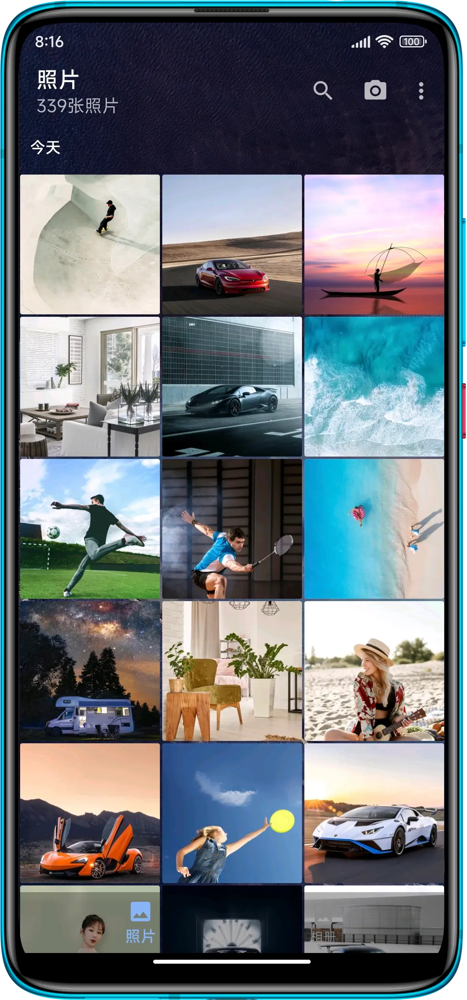
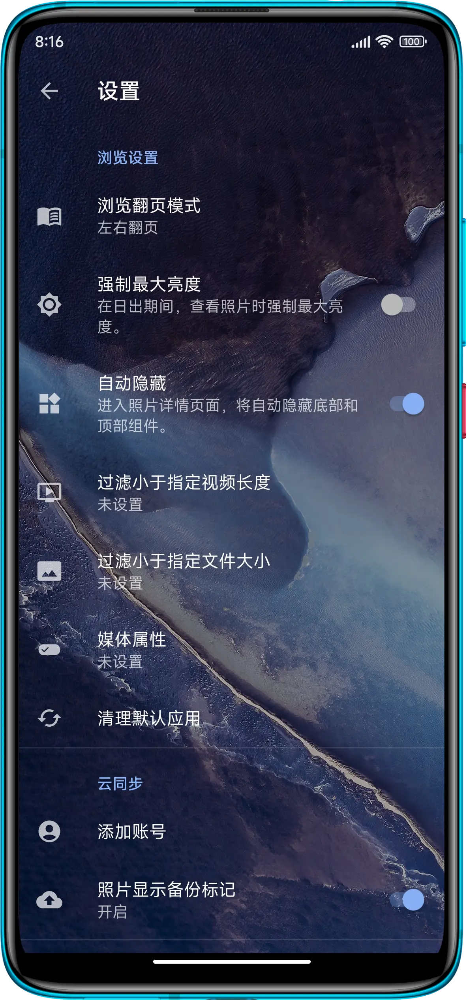
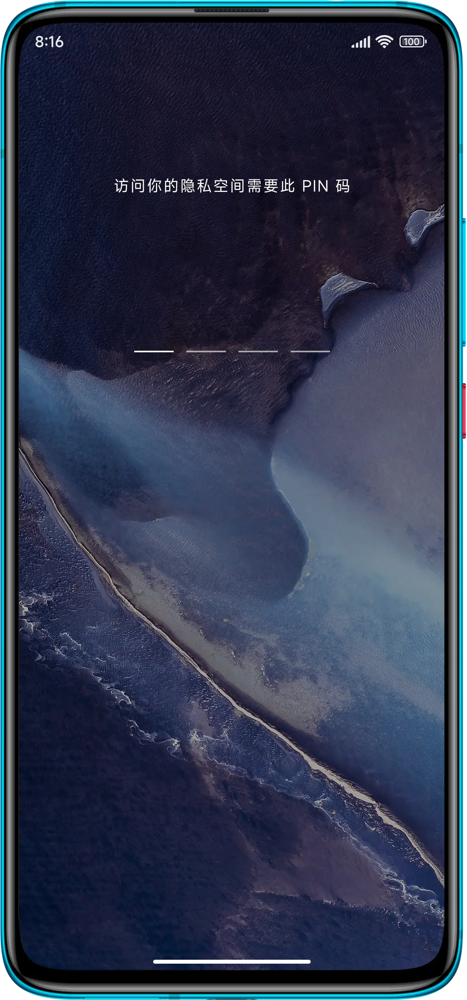
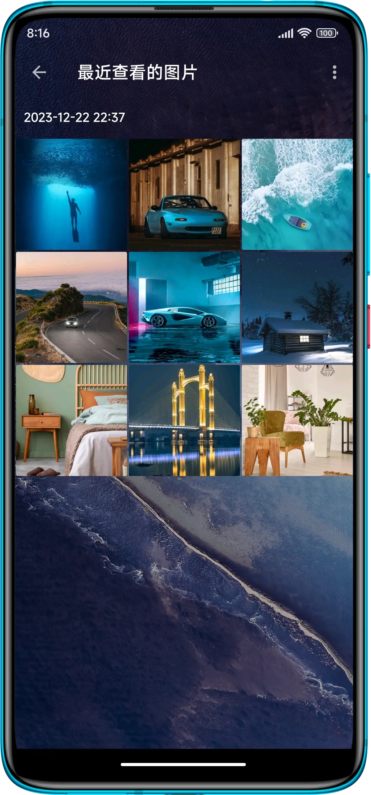
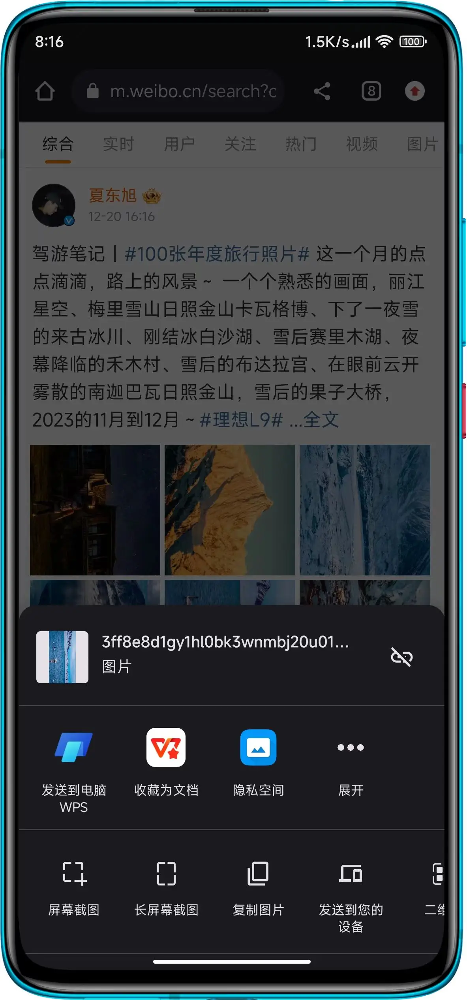

#### 问: 为什么要做慢图浏览这样一个产品？慢图浏览有什么特点？
对于安卓目前的照片的隐私管理，我需要一个安全的照片管理软件，但是目前市面上的照片管理软件都是以云为中心的，并且鉴于国内相册的现状，我不想把我的照片放在别人的服务器上，所以我就自己做了一个。
-  隐私空间，本地存储
-  无广告
-  WebDAV 支持
-  透明主题

#### 问：为什么叫慢图浏览这个名字？
慢即是快，故作为快图浏览的继承者，只好叫慢图浏览了，应用的英文名字叫做 Relax Pic。

#### 问: 遇到问题或不爽怎么办？
请在应用内反馈，或者发邮件到support@relaxpic.com，我会尽快回复。

 

      
      
      
      
      
 

